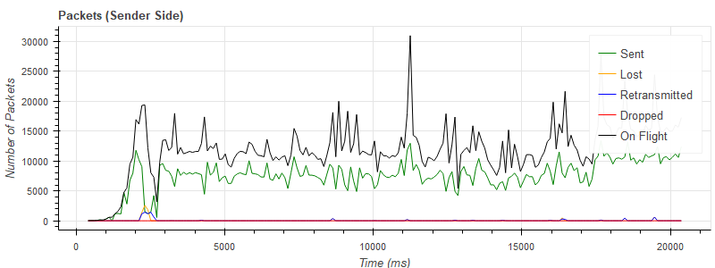
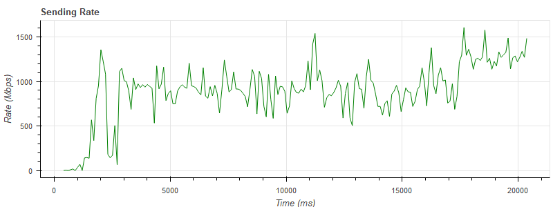
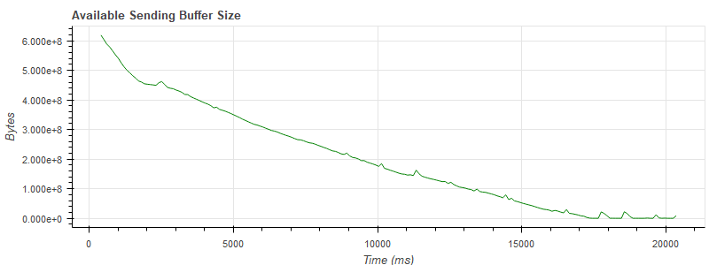

# srt-stats-plotting

<p align="left">
<a href="https://github.com/python/black"></a>
</p>

Plotting script designed to visualize SRT core statistics. 
[SRT](https://github.com/Haivision/srt) stands for Secure Reliable Transport and is an open source transport technology that optimizes streaming performance across unpredictable networks, such as the Internet.

# Requirements

* python 3.6+
* PhantomJS 2.1 optional to [export plots](https://bokeh.pydata.org/en/latest/docs/user_guide/export.html)

To install the library dependencies run:
```
pip install -r requirements.txt
```

# Script Usage

The main purpose of `plot_srt_stats.py` script is to visualize all the SRT core statistics produced during experiments by one of the [testing applications](https://github.com/Haivision/srt/blob/master/docs/stransmit.md) or third-party solutions supporting SRT protocol. Depending on whether this statistics is collected on sender or receiver side, the data plotted may vary.

SRT core statistics should be collected in a `.csv` file. Usually, as a naming convention rule the file name ends either on "-snd" or "-rcv" depending on the side (sender or receiver) where the data was collected. Or, file name can just contain "snd" or "rcv" part in it.

Statistics filepath is passed as an argument to a script. Script usage
```
plot_srt_stats.py [OPTIONS] STATS_FILEPATH
```

Use `--help` option in order to get the full list of options
```
--is-sender   Should be set if sender statistics is provided. Otherwise, it
              is assumed that receiver statistics is provided.
--is-fec      Should be set if packet filter (FEC) stats is enabled.
--export-png  Export plots to .png files.
--help        Show this message and exit.
```

# Plots Description

**Note:** Megabytes and Rate plots correlation is determined by the following formula

_Rate (Mbps) = MB / interval (s),_

where _interval_ is the interval indicating how frequently the statistics is collected (in seconds).


# Example Plots

The script plots different charts from SRT statistics. For example, a chart to visualize statistics on the packets being sent, lost, retransmitted, on flight, dropped.



Another chart illustrates the sending rate in Mbps. 



Available size of the sender's buffer helpts to detect if there is enough space to store outgoing data, or the source generates data faster then SRT can transmit.



# ToDo

* [] Add detailed plots description
* [] Update the plots
* [] Add information which test applications support collecting statistics in .csv and provide commands to use